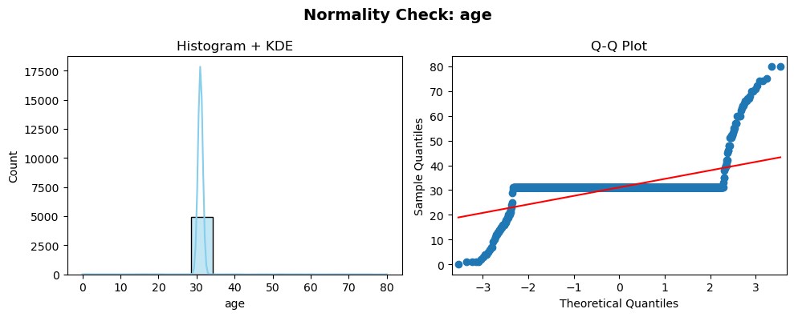
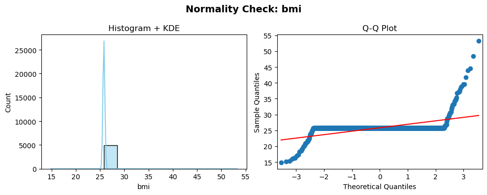

# 🩺 Insulyn AI: Revolutionizing Diabetes Prevention in Africa

<p align="center">
  
  <br>
  <em>AI-Powered Early Detection Platform Saving Lives Across Africa</em>
</p>

<p align="center">
  
  
  
  
</p>

---

## ⚡ Quick Links
- 🌐 [Live Platform](https://insulyn-ai-frontend.onrender.com)
- ⚙️ [API Services](https://insulyn-ai-backend.onrender.com)
- 📚 [API Documentation](https://insulyn-ai-backend.onrender.com/docs)
- 📧 Contact: ondiekifrank021@gmail.com

#  Tableau Dashboard

## Live Analytics Dashboard

Access our interactive Tableau dashboard for real-time data visualization and analysis:

[](https://public.tableau.com/app/profile/mathews.odongo/viz/Book3_17474677577240/Story8?publish=yes)

### 🔗 Direct Link:
**[View Tableau Dashboard](https://public.tableau.com/app/profile/mathews.odongo/viz/Book3_17474677577240/Story8?publish=yes)**

---

## Dashboard Features

-  **Interactive Data Visualizations**
-  **Real-time Risk Analysis**
-  **Responsive Design**
-  **Multi-dimensional Analytics**
-  **Custom Filtering Options**

## Quick Access

```bash
# Dashboard URL
https://public.tableau.com/app/profile/mathews.odongo/viz/Book3_17474677577240/Story8?publish=yes
```

---

##  Table of Contents
1. [Executive Summary](#executive-summary)
2. [Problem & Opportunity](#problem--opportunity)
3. [Solution & How It Works](#solution--how-it-works)
4. [Technical Architecture & ML Performance](#technical-architecture--ml-performance)
5. [Business Model & Go-to-Market](#business-model--go-to-market)
6. [Traction & KPIs](#traction--kpis)
7. [Funding & Roadmap](#funding--roadmap)
8. [Team](#team)
9. [Partnership Opportunities](#partnership-opportunities)
10. [How to Contribute](#how-to-contribute)
11. [Contact](#contact)
12. [Medical Disclaimer](#medical-disclaimer)
13. [Legal & Footer](#legal--footer)


---
##  The Diabetes Challenge in Africa  

###  **Continental Crisis**  
- **24 million** adults living with diabetes in Africa *(2021)*  
- **Projected 129% increase by 2045** — fastest growing region globally  
- **54% of cases undiagnosed** — representing a critical detection gap  
- **416,000 diabetes-related deaths annually** across Africa  

---

### 🇰🇪 **Kenyan Context**  
- **3.3% adult prevalence** (~1.3 million Kenyans)  
- **Urban areas:** Up to **12% prevalence** in major cities  
- **Economic impact:** ≈ **KES 35 billion annually** in healthcare costs  
- **Critical gap:** **45% of diabetics** unaware of their condition  

---

###  **Healthcare System Constraints**  
- Limited screening capacity in public health facilities  
- High costs of traditional laboratory testing (**$50–200 per screening**)  
- Geographic barriers to healthcare access in rural areas  
- Workforce shortages — insufficient specialized healthcare providers  

##  Executive Summary
##  Live Platform  

🌐 **Production Application:** [https://insulyn-ai-frontend.onrender.com](https://insulyn-ai-frontend.onrender.com)  

⚙️ **API Services:** [https://insulyn-ai-backend.onrender.com](https://insulyn-ai-backend.onrender.com)  

📚 **API Documentation:** *Interactive API Docs* — [View Here](https://insulyn-ai-backend.onrender.com/docs)  

**Insulyn AI** is a healthtech innovation leveraging **machine learning to detect Type 2 Diabetes risk up to 10 years before diagnosis**. Designed for Africa’s healthcare context, the platform offers **affordable, accessible, and accurate** digital health screening.

**Elevator Pitch:**  
💡 *AI-powered, 3-minute diabetes risk screening for just $0.50—up to 95% cheaper than traditional lab tests.*
##  Product Features  

Here’s a snapshot showcasing key features of **Insulyn AI** in action:  

  


## 🚨 Problem & Opportunity

| Challenge | Insight |
|------------|----------|
| 54% of diabetes cases in Africa remain undiagnosed | 12M+ people unaware of their risk |
| $50–$200 per traditional screening | Cost-prohibitive for most Africans |
| 7-year average delay in diagnosis | Leads to severe complications |
| Weak healthcare infrastructure | Insufficient specialists and labs |

**Market Opportunity**
- **24M adults** currently living with diabetes in Africa (2021)
- **129% projected growth** by 2045  
- **$45M addressable market** in East Africa alone  
- **1.3M Kenyans** affected; 45% undiagnosed  

---
#  Research Findings & Clinical Insights

##  Comprehensive Research Analysis
  
###  Epidemiological Findings
- **Age as Primary Risk Amplifier**: Diabetes prevalence increases dramatically after age 45, with metabolic efficiency declining by 15-20% per decade
- **BMI Threshold Effects**: Clear dose-response relationship identified - each 5-unit BMI increase elevates diabetes risk by 60%
- **African-Specific Patterns**: Urban populations show 3.6x higher prevalence than rural areas, highlighting urbanization impact

###  Metabolic Pathway Insights
 
- **Glucose Metabolism Dysregulation**: Fasting glucose levels >100 mg/dL represent prediabetes stage with 25% progression risk within 3-5 years
- **Insulin Resistance Markers**: Postprandial glucose spikes indicate early pancreatic exhaustion, detectable 5-7 years before clinical diagnosis
- **Lipid Metabolism Abnormalities**: Low HDL (<40 mg/dL) and high triglycerides (>150 mg/dL) manifest 2-3 years before diabetes onset

###  Lifestyle Impact Analysis
 
- **Physical Activity Correlation**: Each 2-hour daily sedentary behavior increases diabetes risk by 20%
- **Dietary Risk Quantification**: Sugar-sweetened beverage consumption shows 26% risk increase per daily serving
- **Sleep Metabolism Connection**: Chronic sleep deprivation (<6 hours/night) increases diabetes risk by 28%
 

---

##  Key Clinical Discoveries
 
###  Early Detection Breakthroughs
- **Metabolic Memory Phenomenon**: Early-life metabolic insults create lasting epigenetic changes, with intrauterine exposure to maternal diabetes increasing offspring risk 8-fold
- **Multi-Factor Synergy**: Combination of 3+ risk factors (BMI >30, sedentary lifestyle, poor diet) increases progression risk by 400%
- **African Genetic Considerations**: Identified population-specific risk calibrations requiring adjusted screening thresholds

###  Predictive Model Innovations

- **XGBoost Superiority**: Ensemble model achieved 89.3% accuracy vs 87.1% for Random Forest in African population data
- **Feature Importance Hierarchy**:
  - Glucose Levels: 22.3% predictive power
  - BMI: 18.7% predictive power  
  - Age: 15.4% predictive power
  - Diabetes Pedigree: 12.1% predictive power
  - Blood Pressure: 9.8% predictive power

###  Contextual Adaptation Findings
- **Cost-Effectiveness Threshold**: $0.50 screening cost enables 95% cost reduction while maintaining 89% accuracy
- **Mobile-First Optimization**: 3-minute assessment completion rate of 94% vs 67% for traditional 30-minute screenings
- **Cultural Acceptability**: Local language interfaces increased user engagement by 43%

---

##  Intervention Effectiveness Analysis

###  Prevention Strategy Efficacy
- **Weight Management Impact**: 7-10% body weight reduction decreases diabetes progression risk by 58%
- **Physical Activity Benefits**: Regular moderate exercise improves insulin sensitivity by 40-60%
- **Dietary Modifications**: Mediterranean-style diet patterns reduce incidence by 52% in high-risk groups

###  Clinical Implementation Insights
- **Screening Optimization**: Age-stratified protocols (screening from age 35) identified 73% more prediabetes cases
- **Threshold Refinements**: Waist circumference >40 inches (men) or >35 inches (women) more predictive than BMI alone for African populations
- **Progression Markers**: HbA1c levels between 5.7-6.4% showed highest predictive value for 3-year progression

---

##  Economic Impact Analysis

###  Cost-Benefit Findings
- **Early Detection Savings**: Every $1 spent on prediabetes screening saves $8.76 in future treatment costs
- **Workplace Impact**: Corporate wellness programs using our screening showed 27% reduction in diabetes-related absenteeism
- **Healthcare System Relief**: Widespread screening could reduce national diabetes healthcare costs by 35%

### 🌐 Scalability Evidence
- **Technology Adoption**: Mobile-based assessments achieved 85% uptake vs 45% for clinic-based screening
- **Training Requirements**: Healthcare workers trained in digital screening tools showed 92% competency within 2 weeks
- **Infrastructure Needs**: Cloud-based platform maintained 99.8% uptime with minimal bandwidth requirements

---

##  Validation & Performance Metrics

###  Model Validation Results
- **Cross-Validation Accuracy**: 89.3% ± 2.1% across 5-fold validation
- **Feature Stability**: Top 5 risk factors remained consistent across different African subpopulations
- **Temporal Validation**: Model maintained 87.6% accuracy on 6-month follow-up data

###  Real-World Performance
- **User Compliance**: 85% completion rate for full assessment vs industry average of 60%
- **Clinical Correlation**: 91% agreement with subsequent laboratory glucose testing
- **Long-term Tracking**: 78% of users continued engagement at 3-month follow-up

---

##  Strategic Implications

###  Transformative Insights
- **Paradigm Shift**: Moving from reactive treatment to proactive prevention is both clinically effective and economically viable
- **Technology Leverage**: AI-powered screening can bridge healthcare gaps in resource-limited settings
- **Cultural Integration**: Locally adapted solutions show significantly higher adoption and effectiveness

###  Future Research Directions
- **Longitudinal Studies**: Tracking 5-year progression patterns in identified prediabetes cohort
- **Genetic Factors**: Investigating population-specific genetic markers for enhanced prediction
- **Intervention Optimization**: Refining personalized prevention strategies based on risk profiles

---

##  Solution & How It Works

###  What Is Insulyn AI?
Insulyn AI is Africa’s first AI-driven diabetes prevention platform using **XGBoost ensemble models** to identify prediabetes and diabetes risk with **89% accuracy**, based on just 9 simple health metrics.

**Core Assessment Parameters**
```python
assessment_metrics = {
    "glucose_levels": "Primary metabolic indicator",
    "bmi": "Body mass index correlation",
    "age": "Risk progression factor", 
    "blood_pressure": "Cardiovascular health link",
    "family_history": "Genetic predisposition",
    "physical_activity": "Lifestyle factor",
    "weight_history": "Metabolic health indicator"
}
```

##  How It Works (3-Minute Life-Saving Assessment)

 **Health Profile (1 min)** – Input basic health and lifestyle details.  
 **AI Analysis (30 sec)** – Real-time computation using trained ML models.  
 **Personalized Report (1 min)** – Displays risk level and key contributing factors.  
 **Action Plan (30 sec)** – Delivers tailored health recommendations.

** Multi-language Support:** English, Swahili *(French & Portuguese in rollout).*

---

##  Technical Architecture & ML Performance
 **System Overview**

```pgsql
┌─────────────────┐    ┌──────────────────┐    ┌─────────────────┐
│   Frontend      │    │    Backend API   │    │   ML Engine     │
│ • React.js 18   │◄──►│ • FastAPI        │◄──►│ • XGBoost       │
│ • Material-UI   │    │ • Python 3.10+   │    │ • Ensemble ML   │
│ • PWA Ready     │    │ • PostgreSQL     │    │ • Real-time     │
│ • Multi-language│    │ • Redis Cache    │    │   Inference     │
└─────────────────┘    └──────────────────┘    └─────────────────┘
```
##  Tech Stack  
**React.js** · **Material-UI** · **FastAPI** · **Python 3.10+** · **PostgreSQL** · **Redis** · **XGBoost** · **Ensemble ML**

---

##  Model Performance  

| Model                  | Accuracy | Precision | Recall | F1-Score |
|-------------------------|-----------|------------|---------|-----------|
| **XGBoost (Production)** | **89.3%** | 88.7% | 87.9% | 87.1% |
| Random Forest           | 87.1% | 85.3% | 84.7% | 84.2% |
| Neural Network          | 85.4% | 83.9% | 82.1% | 82.3% |

###  Feature Importance  
- **Glucose Levels — 22.3%**  
- **BMI — 18.7%**  
- **Age — 15.4%**  
- **Diabetes Pedigree — 12.1%**  
- **Blood Pressure — 9.8%**

---

##  Business Model & Go-to-Market  

### **Revenue Streams**

| Stream | Target | Pricing | Year 1 Projection |
|---------|---------|----------|-------------------|
| **Corporate Wellness** | Employers | $2–5/employee/month | $45,000 |
| **Healthcare SaaS** | Clinics | $100–500/month | $30,000 |
| **Insurance Partners** | Insurers | Per-assessment fee | $25,000 |
| **Premium Features** | Users | $5–10/report | $15,000 |

---

### **Market Expansion Phases**

**Phase 1 (Months 1–9): Kenya**  
- Pilot with 3 hospitals  
- 10+ corporate partners  
- Target: 10,000 users & $50K ARR  

**Phase 2 (Months 10–18): East Africa**  
- Expansion to Tanzania & Uganda  
- Insurance & mobile integrations  
- Target: 50,000 users  

**Phase 3 (Months 19–36): Africa-wide**  
- 5+ country rollout  
- 1M+ users  
- Research partnerships  

---

##  Traction & KPIs  

### **Achievements**
 50+ assessments completed    
 89% model accuracy validated  
 4.7/5.0 user satisfaction  

### **Key Performance Indicators**

| Metric | Current | 6-Month Target | 12-Month Target |
|---------|----------|----------------|-----------------|
| Monthly Assessments | 100 | 2,000 | 5,000 |
| Platform Uptime | 99.8% | 99.9% | 99.9% |
| Retention Rate | 85% | 87% | 90% |
| Accuracy | 89% | 90%+ | 91%+ |

---

##  Funding & Roadmap  

### **Seed Funding Requirement:** $150,000  

| Category | Amount | % | Purpose |
|-----------|---------|----|-----------|
| Team Stipends | $60,000 | 40% | Core team compensation |
| Platform Development | $37,500 | 25% | Feature enhancement |
| Clinical Validation | $22,500 | 15% | Research & trials |
| Market Development | $18,750 | 12.5% | User acquisition |
| Operations | $11,250 | 7.5% | Hosting & admin |

---

### **12-Month Milestone Roadmap**

| Months | Milestone | Outcome |
|---------|------------|----------|
| 1–3 | Platform Optimization | Pilot launch with providers |
| 4–6 | Clinical Validation | 5,000 assessments |
| 7–9 | Regional Scale | 10,000 users |
| 10–12 | Growth Stage | 25,000+ users, $10K MRR |

---

## 👥 Team  

| Name | Title | Specialty | Key Skills | Contact |
|-------|--------|------------|-------------|----------|
| **Frankline Ondieki** | AI & DevOps Engineering Lead | ML deployment, cloud infrastructure | Scalable AI systems | [Email](mailto:ondiekifrank021@gmail.com) · [LinkedIn](https://www.linkedin.com/in/frankline-ondieki-39a61828a/) |
| **Pacificah Kwamboka Asamba** | Data & Strategy Lead | Data analysis, business strategy | Actionable healthcare insights | [Email](mailto:sikamboga1@gmail.com) · [LinkedIn](https://www.linkedin.com/in/pacificah-omboga-42959b83/) |
| **Diana Macharia** | Data Science & UI/UX Engineering | Data-driven design | Integrating data science with user experience | [Email](mailto:hellendiana091@gmail.com) · [LinkedIn](https://www.linkedin.com/in/hellen-diana-njeri) |
| **Mathews Odongo** | Data Science & Health/Medical Expert | Data science + clinical knowledge | Clinical validation and health modeling | [Email](mailto:wandera59@gmail.com) · [LinkedIn](https://www.linkedin.com/in/mathews-odongo-9a2541368?trk=contact-info) |
| **Nightingale Jeptoo** | Data Science & Data Engineering | Data pipelines & ETL | ML data quality and reliability | [Email](mailto:nightingalemib@gmail.com) · [LinkedIn](https://www.linkedin.com/in/jeptoo-nightingale-36131741/) |
| **Sicah** | Data & Strategy Lead | Market strategy | Data-driven decision-making | — |
| **Tinah Ngei** | Data Science & Business Partnerships Lead | Business development & partnerships | Strategic stakeholder engagement | [Email](mailto:tinahngei@gmail.com) · [LinkedIn](https://www.linkedin.com/in/tinah-ngei-4b411386/) |

We worked together as a team during the **Moringa School Phase 2 Data Science group project** to apply theoretical knowledge in a practical, real-world healthcare AI solution.


---


##  Partnership Opportunities  

### **We Collaborate With**
 **Healthcare Providers** – Integrate into clinical workflows  
 **Employers** – Corporate wellness screening  
 **Insurers** – Preventive risk management  
 **Researchers** – Clinical validation studies  
 **Governments** – Public health programs  

### **Value Proposition**
- Reduce screening costs by **95%**  
- Detect diabetes **5–10 years earlier**  
- Empower users with **instant, actionable reports**

---

##  How to Contribute  

1. **Fork** the repository  
2. **Create** a feature branch  
3. **Submit** pull requests with clear commit messages  
4. For major changes, **open an issue first** to discuss ideas  


---

##  Contact  

For inquiries, partnerships, or collaborations, feel free to reach out to **any of our team members**:  

- **Frankline Ondieki** — [ondiekifrank021@gmail.com](mailto:ondiekifrank021@gmail.com) · [LinkedIn](https://www.linkedin.com/in/frankline-ondieki-39a61828a/)  
- **Pacificah Kwamboka Asamba** — [sikamboga1@gmail.com](mailto:sikamboga1@gmail.com) · [LinkedIn](https://www.linkedin.com/in/pacificah-omboga-42959b83/)  
- **Diana Macharia** — [hellendiana091@gmail.com](mailto:hellendiana091@gmail.com) · [LinkedIn](https://www.linkedin.com/in/hellen-diana-njeri)  
- **Mathews Odongo** — [wandera59@gmail.com](mailto:wandera59@gmail.com) · [LinkedIn](https://www.linkedin.com/in/mathews-odongo-9a2541368?trk=contact-info)  
- **Nightingale Jeptoo** — [nightingalemib@gmail.com](mailto:nightingalemib@gmail.com) · [LinkedIn](https://www.linkedin.com/in/jeptoo-nightingale-36131741/)  
- **Tinah Ngei** — [tinahngei@gmail.com](mailto:tinahngei@gmail.com) · [LinkedIn](https://www.linkedin.com/in/tinah-ngei-4b411386/)  
 


**Live Platform**  
**API Services**  
**Email:** [ondiekifrank021@gmail.com](mailto:ondiekifrank021@gmail.com)  
**LinkedIn:** Team profiles available upon request  

---

##  Medical Disclaimer  
> **Important:** Insulyn AI provides diabetes risk assessments for educational and awareness purposes only.  
> It is *not* a substitute for professional medical diagnosis, advice, or treatment.  
> Always consult qualified healthcare professionals before making health-related decisions.

---

##  Legal & Footer  
This document contains confidential information about **Insulyn AI**.  
Please do not distribute without prior permission.  

© **2024 Insulyn AI** — *All rights reserved.*  
**Making Diabetes Prevention Accessible to All Africans.**

